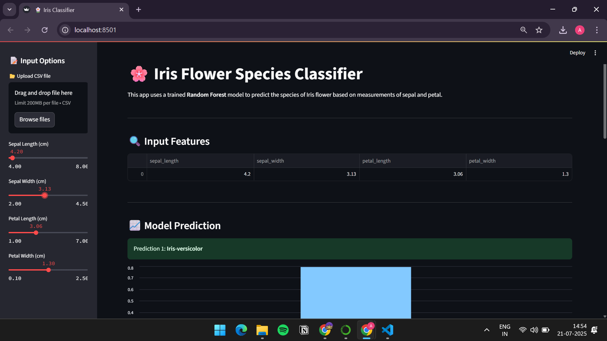
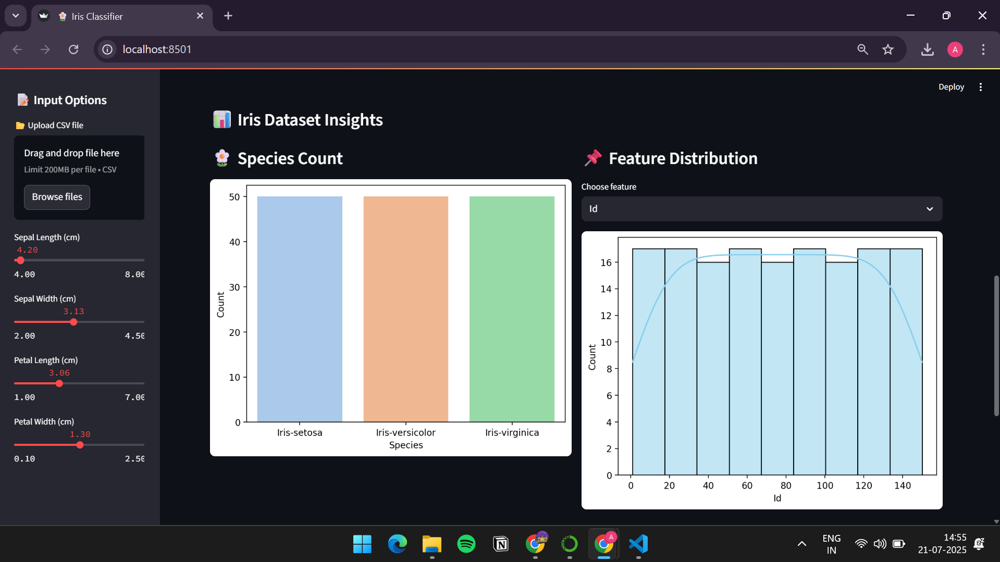
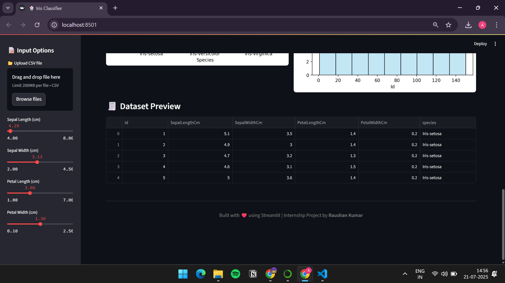

# 🌸 Streamlit ML Iris Classifier

A web application built with **Streamlit** to classify iris flowers using a trained **machine learning model**. Users can input flower measurements and get real-time predictions along with data visualizations.

---

## 📌 Project Overview

This project demonstrates how to:

- Preprocess and train an ML model (Random Forest Classifier)
- Save and reuse the trained model using `joblib`
- Build an interactive web interface with **Streamlit**
- Perform real-time predictions based on user input
- Visualize dataset insights using Matplotlib and Seaborn

---

## 📁 Folder Structure

```
Streamlit_ML_Iris_project/
├── app.py               # Streamlit web app
├── train_model.py       # Training and saving the model
├── iris.csv             # Dataset file
├── venv/                # Python virtual environment
├── .gitignore
└── requirements.txt     # All dependencies
```

---

## 🚀 How to Run This Project

### 1️⃣ Clone the Repo

```bash
git clone https://github.com/raushan0422/raushan0422-Streamlit_ML_Iris_project.git
cd raushan0422-Streamlit_ML_Iris_project
```

### 2️⃣ Create a Virtual Environment

```bash
python -m venv venv
venv\Scripts\activate     # On Windows
# source venv/bin/activate # On Linux/macOS
```

### 3️⃣ Install Requirements

```bash
pip install -r requirements.txt
```

### 4️⃣ Train the Model

```bash
python train_model.py
```

This will train the model and save it as `iris_model.pkl`.

### 5️⃣ Run the Streamlit App

```bash
streamlit run app.py
```

Open the URL in your browser (`http://localhost:8501`) to view the app.

---

## 🎯 Features

- 🌼 User-friendly interface to input Sepal & Petal measurements
- 📊 Live predictions using trained Random Forest model
- 📈 Data visualizations: pairplot, correlation heatmap, class countplot
- ✅ Model accuracy printed after training

---

## 🧠 Model Used

- Algorithm: `RandomForestClassifier` from Scikit-learn
- Trained on the classic Iris dataset (150 samples, 3 classes)
- Accuracy: ~96–98% on the training data

---

## 📦 Dependencies

- `streamlit`
- `pandas`
- `numpy`
- `scikit-learn`
- `seaborn`
- `matplotlib`
- `joblib`

All listed in `requirements.txt`.

---


## 📸 Project Screenshots

### 🔹 Iris Prediction Interface


### 🔹 Iris Dataset Insights


### 🔹 Dataset Preview



## 🙋‍♂️ Author

**Raushan Kumar**  
GitHub: [@raushan0422](https://github.com/raushan0422)
